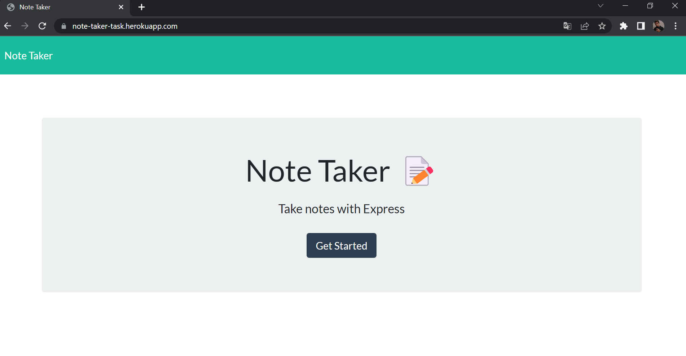
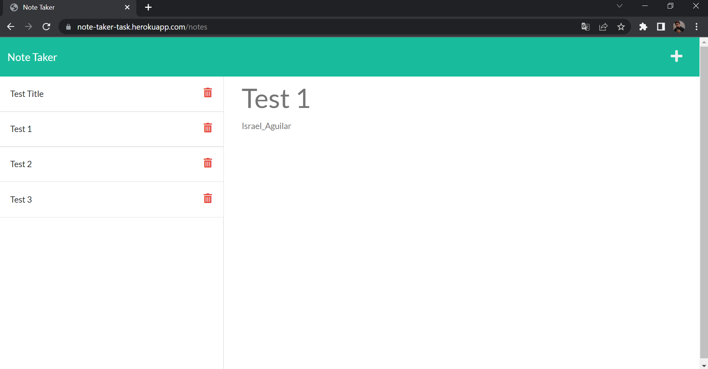

# The Note Taker

[](https://github.com/israel2800)
[](https://github.com/Israel2800/note-taker-challenge)
[](https://github.com/Israel2800/note-taker-challenge)
[](https://nodejs.org/en/)
[](https://www.npmjs.com/package/inquirer)
[](https://choosealicense.com/licenses/mit/)

## Table of Content
* [ Project Links ](#Project-Links)
* [ Screenshots-Demo ](#Screenshots)
* [ Project Objective ](#Project-Objective)
* [ User Story ](#User-Story)
* [ Technologies ](#Technologies)
* [ Installation ](#Installation)
* [ Usage ](#Usage)
* [ Credits and Reference ](#Credits-and-Reference)
* [ Tests ](#Tests)
* [ Author Contact ](#Author-Contact)
* [ License ](#License)
#

##  Project Links
Web Application:
https://note-taker-task.herokuapp.com/

GitHub project:
https://github.com/Israel2800/the-note-taker


## Screenshots-Demo




## Project Objective
Web application with the funcionality as a note taker, in which you can write, save and delete all the notes you want, this could help you organize and keep track of all the information you would like to save, you can also view all your notes at every time you want with your latest updates.


## User Story
AS A small business owner, I WANT to be able to write and save notes, SO THAT I can organize my thoughts and keep track of tasks I need to complete.

## Technologies 
```
express.js, node.js, JavaScript, HTML and CSS
```

## Installation
Access to the GitHub project and clone or download the project, you can do this by clicking in the green button with the word "Code". If you decided to clone the repo you need to choose one of the SSH/HTTPS keys and copy one, after this you will need to open the terminal of your choice and type "git clone 'key'" you will need to paste one of the two keys you previously select and then click enter. If you decided to download the project you will click in the "Download.zip" option and the project will be downloaded so you will locate the file and do a right-click to select "Extract All" and you can choose where tu place it.

## Usage 
To use this app you will need to download and install the terminal for mac or gitbash for windows. You may also need to install [node.js](https://nodejs.org/en/) and [npm](https://www.npmjs.com/) using the terminal. You will open the project in the code editor of your choice and then open the terminal and type "npm install" to install the dependencies "express" and "nodemon". Finally you will be able to start the app typing "npm start" or "node server.js" on your terminal or gitbash. Then you will need to open the navigator with the specific port or just click [here](https://note-taker-task.herokuapp.com/) to open the app.

## Credits and Reference
The following link helped me with this project: https://www.npmjs.com/package/express

## Tests
npm test

## Author Contact
Contact the author with any questions!<br>
Github link: [Israel2800](https://github.com/israel2800)<br>
Email: dady281100@gmail.com

## License
This project is [MIT](https://choosealicense.com/licenses/mit/) licensed.<br />

Copyright © 2022 [ISRAEL AGUILAR](https://github.com/israel2800)

<hr>
<p align='center'><i>
This README was generated with ❤️ by ISRAEL AGUILAR
</i></p>
